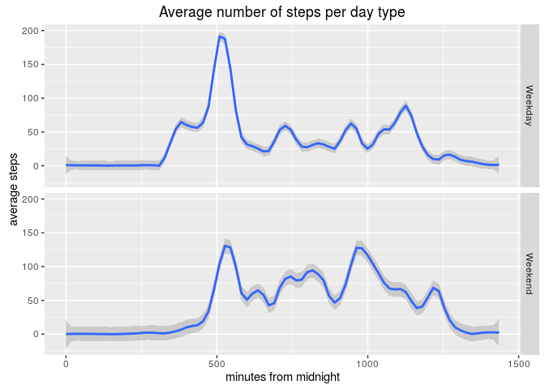

# Reproducible Research: Peer Assessment 1


Hello, and welcome. This is my report for the assignment of the second week in Reproducible Research on Coursera.

## Loading and preprocessing the data
First of all, let's load some data.
We introduce the column minutes that considers how many minutes have passed from midnight.
This is done to avoid a jump when a new hour starts (for instance, between 0855 and 0900).

```r
library(dplyr)
act <- read.csv("activity.csv")
act <- mutate(act, minutes = (interval %/% 100) * 60 + interval%%100)
```

## What is the mean total number of steps taken per day?
Now we calculate the total number of steps per day using aggregate and then plot it with a histogram. We also give the mean and median.

```r
stepTot <- aggregate(steps ~ date, act, sum)
library(ggplot2)
ggplot(stepTot, aes(x=date, weight=steps)) + 
        geom_bar() + 
        ggtitle("Data for OCT and NOV 2012") + 
        labs(x="date", y="total steps")
```

<!-- -->

```r
mean(stepTot$steps)     # average number of steps per day 
```

```
## [1] 10766.19
```

```r
median(stepTot$steps)   # median of the  number of steps per day 
```

```
## [1] 10765
```

## What is the average daily activity pattern?
Next, we are interested in the average number of steps across all days in the set as a function of the time of the day.

```r
stepTime <- aggregate(steps ~ minutes, act, mean)
ggplot(stepTime, aes(x=minutes, y=steps)) +
        geom_line() +
        ggtitle("Average number of steps during the day") + 
        labs(x="minutes from midnight", y="average steps")
```

<!-- -->

```r
with(stepTime, minutes[which.max(steps)])
```

```
## [1] 515
```
Apparently, our test subject is an early bird: his period of highest activity is around 8:35 am (515 minutes after midnight).

## Imputing missing values
There is a certain number of values missing:

```r
sum(is.na(act$steps))    # Total number of missing values
```

```
## [1] 2304
```

```r
mean(is.na(act$steps))   # Proportion of missing values
```

```
## [1] 0.1311475
```

We substitute them with the average value for that period of the day.

```r
actImputed <- act
missing <- is.na(act$steps)
actImputed[missing, 1] <- stepTime[stepTime$minutes==act$minutes[missing],2]
```

Finally, we recalculate the initial values:

```r
stepTotImputed <- aggregate(steps ~ date, actImputed, sum)
library(ggplot2)
ggplot(stepTotImputed, aes(x=date, weight=steps)) + 
        geom_bar() + 
        ggtitle("(Partially imputed) Data for OCT and NOV 2012") + 
        labs(x="date", y="steps")
```

<!-- -->

```r
mean(stepTotImputed$steps)     # average number of steps per day 
```

```
## [1] 10766.19
```

```r
median(stepTotImputed$steps)   # median of the  number of steps per day 
```

```
## [1] 10765.59
```
We see that the mean is the same as before. This is somewhat surprising, because the substitution we have chosen is based on the average per time interval and not per day.
However, this works because the missing data comes from entire days, as we can see from the following:

```r
intervalsPerDay = 60*24/5
sum(is.na(act$steps)) == length(unique(act$date[missing]))*intervalsPerDay
```

```
## [1] TRUE
```
Therefore, making the average over the time for an entire day or making the average over the day gives the same result.
To conclude, the median is not exactly the same, but very similar.

## Are there differences in activity patterns between weekdays and weekends?
First of all, we set a new column dayType to identify weekdays and weekends.

```r
Sys.setlocale("LC_TIME", "C") # This makes sure that weekdays replies in English
wkd = c("Monday", "Tuesday", "Wednesday", "Thursday", "Friday")
actImputed <- mutate(actImputed, dayType=as.factor(ifelse(weekdays(as.Date(date)) %in% wkd, "Weekday", "Weekend")))
```
Then we plot the result.

```r
stepImputedType <- aggregate(steps ~ minutes + dayType, actImputed, mean)
ggplot(stepImputedType, aes(x=minutes, y=steps, col=dayType)) + 
        #geom_line() + 
        geom_smooth(span=0.1) +
        ggtitle("Average number of steps per day type") + 
        labs(x="minutes from midnight", y="average steps")
```

<!-- -->

This result has been smoothed out. In case you prefer the original plot, you can uncomment geom_line and comment geom_smooth instead.
